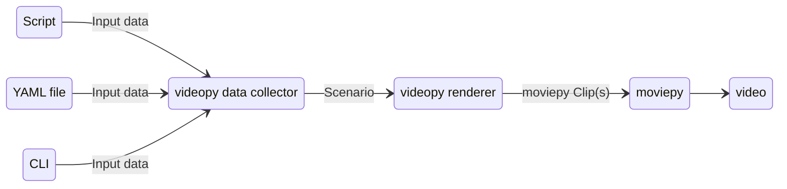

# VideoPy

## What is VideoPy?

VideoPy is an application built on top of the moviepy library, designed to streamline the process of creating videos
through the use of YAML files. By defining video scenarios in YAML, VideoPy allows users to automate common video
creation tasks, making it accessible even to those with minimal programming experience.

You can jump to the [Examples](#examples) section to see some examples of how to use VideoPy.

> **Info**: I just started this project, and it's in the early stages of development. I'm planning to add many more features
but I already found it useful for my personal needs, so I'm sharing it with community, maybe someone will
find it useful too.

## How to start with VideoPy?
After the [installation](#installation) you can start using VideoPy by running the following command:
```shell
python video.py helpers examples
```
It will generate examples in the `example.md` file. You can use these examples to start creating your own scenarios.

## How it works?


## Why Use VideoPy?

### VideoPy simplifies and automates the video creation process by allowing you to:

- Define video scenarios in a straightforward YAML format.
- Automate repetitive video creation tasks, reducing the need for advanced video editing software.
- Create custom scripts in Python that generate YAML scenario files, offering flexibility for more advanced users.

# Installation

## Git

1. Clone the repository
2. Install the required dependencies using
```shell
pip install -r requirements.txt
```
3. Run the application using 
```shell
python videopy.py run --scenario-file example/scenario.yml
```

> More installation options coming in the future

# Modules

## What's a module?

Modules are the building blocks of VideoPy scenarios. They define the different components that make up a video, such as
frames, blocks, effects, and more. Each module has a specific purpose and can be combined to create video scenarios.

## Scenarios

### Creating scenario

1. Create fully using YAML files. (`example/scenario.yaml`)
2. Create using Python scripts that generate these YAML files (`plugins/core/scenarios/images_dir_to_video.py`).

### Using scenarios from plugins

To list available scenarios use:
```shell
python video.py scenarios
```

To get more information about a specific scenario use:
```shell
python video.py scenario __scenario_name__
```

## Frames

To list available frames use:
```shell
python video.py frames
```

To get more information about a specific frame use:
```shell
python video.py frame __frame_name__
```

## Blocks

To list available blocks use:
```shell
python video.py blocks
```

To get more information about a specific block use:
```shell
python video.py block __block_name__
```

## Effects

To list available effects use:
```shell
python video.py effects
```

To get more information about a specific effect use:
```shell
python video.py effect __effect_name__
```

> Each of the commands above will display a table containing information about given module.

